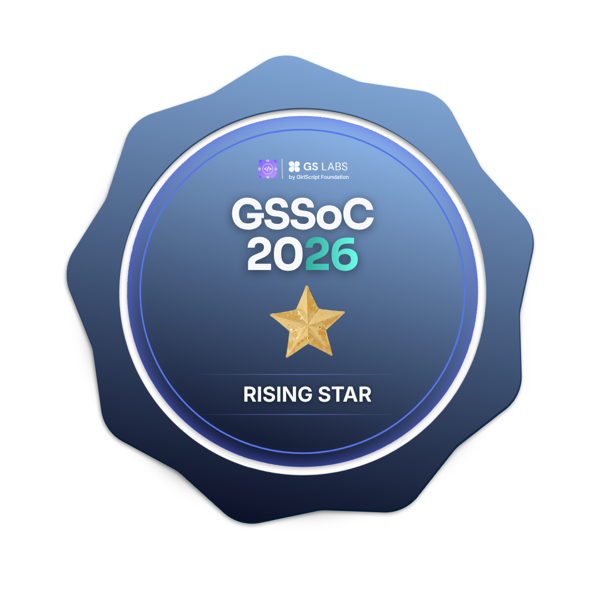

<!-- COMMAND CENTER HEADER -->

  

<!-- SYSTEM IDENTITY CONSOLE -->
<table width="100%">
<tr>
<td width="55%" valign="top">
<pre>
┌─────────────────────────────────────────────────────────┐
│ SYSTEM Identity // ADELIN PATRICIA                     │
├─────────────────────────────────────────────────────────┤
│ ROLE     : IT Student & Developer                        │
│ FOCUS    : Backend Architecture & Engineering           │
│ PATH     : IT Student ➔ Full-Stack ➔ Backend Focus     │
│ STATUS   : ● OPEN TO INTERNSHIPS                        │
└─────────────────────────────────────────────────────────┘
</pre>
</td>
<td width="45%" valign="top">
<pre>
┌─────────────────────────────────────────────────────────┐
│ TELEMETRY METADATA                                      │
├─────────────────────────────────────────────────────────┤
│ HOST     : github.com/adepat06                          │
│ LOG      : GSSoC 2026 Contributor (20 PRs Merged)       │
│ MINDSET  : Hard-working · Sincere · Big Dreamer        │
│ LOC      : System Idle / Ready for Deployment           │
└─────────────────────────────────────────────────────────┘
</pre>
</td>
</tr>
</table>

<!-- HERO TAGLINE -->

  <code>[ TAGLINE ]</code> &nbsp; <b>Constructing reliable backends through methodical, practical iteration.</b>

<!-- NAVIGATION INTERFACE -->

  <code><a href="#01-about">01_ABOUT</a></code> &nbsp;■&nbsp;
  <code><a href="#02-open-source">02_OPEN_SOURCE</a></code> &nbsp;■&nbsp;
  <code><a href="#03-stack">03_STACK</a></code> &nbsp;■&nbsp;
  <code><a href="#04-in-progress">04_IN_PROGRESS</a></code> &nbsp;■&nbsp;
  <code><a href="#05-build-log">05_BUILD_LOG</a></code> &nbsp;■&nbsp;
  <code><a href="#06-telemetry">06_TELEMETRY</a></code> &nbsp;■&nbsp;
  <code><a href="#07-connect">07_CONNECT</a></code>

 

<!-- ==================== 01 ABOUT ==================== -->

### <code>01 // ABOUT</code> — Profile Data

<table width="100%">
  <tr>
    <td width="33%" valign="top">
      <h4><code>[01.1] IDENTITY</code></h4>
      <ul>
        <li><b>ROLE:</b> IT Student</li>
        <li><b>PATH:</b> Full-Stack Development</li>
        <li><b>DIRECTION:</b> IT Student → Full-Stack → Backend Focus</li>
      </ul>
    </td>
    <td width="33%" valign="top">
      <h4><code>[01.2] OBJECTIVE</code></h4>
      <ul>
        <li><b>PRIMARY FOCUS:</b> Backend Development</li>
        <li><b>BUILDING:</b> Real-world, practical projects</li>
        <li><b>LOOKING FOR:</b> Internship Opportunities</li>
      </ul>
    </td>
    <td width="33%" valign="top">
      <h4><code>[01.3] PHILOSOPHY</code></h4>
      <ul>
        <li><b>MINDSET:</b> Hard-working · Sincere · Big Dreamer</li>
        <li><b>ETHOS:</b> Learning in public — every merged PR is part of the process.</li>
      </ul>
    </td>
  </tr>
</table>

 

<!-- ==================== 02 OPEN SOURCE ==================== -->

### <code>02 // OPEN SOURCE LOG</code> — GSSoC 2026

<table width="100%">
<tr>
<td align="center" colspan="4">
   
  
    
  <code>ACHIEVEMENT CONSOLE // 8 BADGES UNLOCKED</code>
    
</td>
</tr>
<tr>
<td align="center" width="25%">
   
  <code><b>RISING STAR</b></code>
</td>
<td align="center" width="25%">
   
  <code><b>BOUNTY HUNTER</b></code>
</td>
<td align="center" width="25%">
   
  <code><b>DISCORD VERIFIED</b></code>
</td>
<td align="center" width="25%">
   
  <code><b>FIRST STEPS</b></code>
</td>
</tr>
<tr>
<td align="center" width="25%">
   
  <code><b>POINT SCORER</b></code>
</td>
<td align="center" width="25%">
   
  <code><b>PROFILE COMPLETE</b></code>
</td>
<td align="center" width="25%">
   
  <code><b>ROLE CONTRIBUTOR</b></code>
</td>
<td align="center" width="25%">
   
  <code><b>BOUNTY MASTER</b></code>
</td>
</tr>
</table>

 

<!-- ==================== 03 TECH STACK ==================== -->

### <code>03 // ENGINEERING STACK</code> — Technical Specification

<table>
<tr>
  <td width="22%" valign="middle"><code>LANGUAGES</code></td>
  <td>
    
    
    
    
  </td>
</tr>
<tr>
  <td width="22%" valign="middle"><code>FRONTEND</code></td>
  <td>
    
    
  </td>
</tr>
<tr>
  <td width="22%" valign="middle"><code>BACKEND [FOCUS]</code></td>
  <td>
    
    &nbsp;<code><b>← PRIMARY CORE FOCUS</b></code>
  </td>
</tr>
<tr>
  <td width="22%" valign="middle"><code>DATABASE</code></td>
  <td>
    
  </td>
</tr>
<tr>
  <td width="22%" valign="middle"><code>TOOLS / PLATFORMS</code></td>
  <td>
    
    
  </td>
</tr>
</table>

 

<!-- ==================== 04 SYSTEM IN PROGRESS ==================== -->

### <code>04 // SYSTEM IN PROGRESS</code> — Live Development Pipeline

<table width="100%">
<tr>
<td align="center">
<pre>
[ PHASE 01: IT STUDENT ] ───► [ PHASE 02: FULL-STACK DEVELOPMENT ] ───► [ PHASE 03: BACKEND DEPTH ] ───► [ PHASE 04: REAL-WORLD PROJECTS ]
                                          │
                                          └───► CURRENT ACTIVE FOCUS: Deepening backend systems knowledge & open-source contributions.
</pre>
</td>
</tr>
</table>

 

<!-- ==================== 05 BUILD LOG ==================== -->

### <code>05 // BUILD LOG</code> — Engineering Projects

Replace project modules below as active repositories are ready for deployment showcase.

<table width="100%">
<tr>
<td width="50%" valign="top">

<code><b>BUILD_001 // PROJECT_ALPHA</b></code>

 

> *Real-world application focused on core backend architecture and efficient data routing.*
